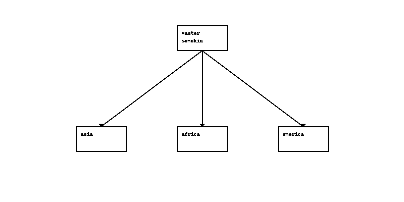
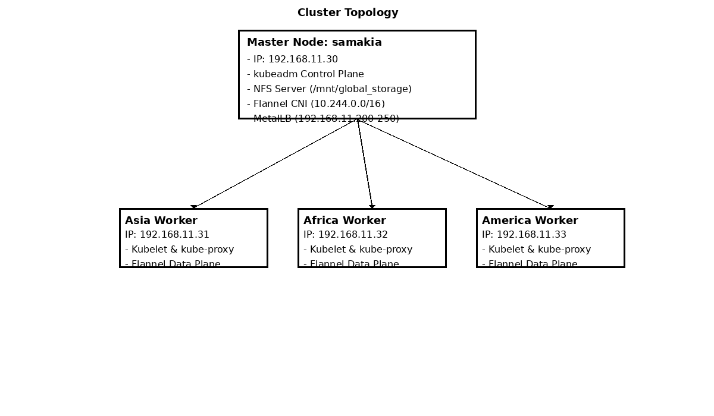

# samakia-gitops

 

[ ](https://argocd.example.com/applications/samakia-root)
[ ](https://kubernetes.io/)
[ ](LICENSE)

A fully GitOps-driven Kubernetes cluster configured for local, multi-node development and production parity.
This repository defines **cluster-level infrastructure** and **application deployments** using ArgoCD’s App-of-Apps pattern, Helm charts, and Kustomize overlays.


---

## 📖 Table of Contents


1. [Overview](#overview)
2. [Directory Structure](#directory-structure)
3. [Infrastructure Components](#infrastructure-components)
4. [Services](#services)
5. [Environments](#environments)
6. [Getting Started](#getting-started)
7. [Contributing](#contributing)
8. [License](#license)


---

## 🚀 Overview

On-premises Kubernetes cluster running on the physical host **samakia** (Ubuntu 22.04) with three KubeVirt-based worker VMs (asia, africa, america) to simulate a multi-continent setup. All resources are declared via Git:

* **Control Plane**: kubeadm‑provisioned Kubernetes v1.33.0
* **CNI**: Flannel overlay network (10.244.0.0/16)
* **Load Balancer**: [MetalLB](https://metallb.universe.tf/) L2 mode (192.168.11.200–250)
* **Storage**: NFS server at `/mnt/global_storage` & [Longhorn](https://longhorn.io/) for distributed block storage
* **Ingress**: [Traefik](https://traefik.io/) with local ACME via mkcert
* **GitOps**: [ArgoCD](https://argo-cd.readthedocs.io/) App-of-Apps (self-heal, prune: false)
* **Monitoring**: Prometheus (15s scrape), Loki (14d logs), Grafana (dashboards)
* **VMs**: [KubeVirt](https://kubevirt.io/)
* **API / Auth**: Kong Gateway, Keycloak

 


---

## 📂 Directory Structure

```
.samakia-gitops/
├── .argocd/                   # ArgoCD root App-of-Apps
│   └── root-app.yaml
├── docs/                      # Architecture docs & diagrams
│   └── architecture/
│       ├── overview.md
│       └── components.md
├── infrastructure/            # Cluster-level helm/kustomize
│   ├── bootstrap/
│   ├── networking/
│   ├── storage/
│   ├── ingress/
│   ├── kubevirt/
│   ├── monitoring/
│   └── platform-crds/
├── services/                  # Microservices & front-end
│   ├── users/
│   ├── species/
│   ├── birds/
│   ├── pairs/
│   └── portal/
└── environments/              # Dev & Prod slices
    ├── dev/
    └── prod/
```


---

## 🛠 Infrastructure Components

### Flannel (CNI)

* **Version**: v0.25.0
* **Purpose**: Pod-to-Pod networking via VXLAN overlay.
* **Config**: `10.244.0.0/16` CIDR
* **Manifest**: `infrastructure/networking/kustomization.yaml`

### MetalLB (LoadBalancer)

* **Version**: v0.13.8
* **Purpose**: Exposes `Service(type=LoadBalancer)` via ARP-based IP pool.
* **Range**: `192.168.11.200–250`
* **Config**: `infrastructure/networking/metallb-config.yaml`

### NFS & Longhorn (Storage)

* **NFS**: Exported from samakia at `/mnt/global_storage`.
  * StorageClass: `nfs`, reclaim: Delete.
* **Longhorn**: Distributed block storage with HA.
  * Default StorageClass via `infrastructure/storage/longhorn-helm-values.yaml`

### Traefik (Ingress)

* **Version**: latest stable
* **Purpose**: TLS termination & HTTP routing
* **ACME**: Local CA via [mkcert](https://github.com/FiloSottile/mkcert)
* **Values**: `infrastructure/ingress/traefik-helm-values.yaml`

### ArgoCD (GitOps)

* **Purpose**: Continuous delivery of all infra & apps.
* **Pattern**: App-of-Apps in `.argocd/root-app.yaml`
* **SyncPolicy**: `automated.selfHeal=true`, `prune=false`

### Prometheus, Loki & Grafana (Monitoring)

* **Prometheus**: Helm values in `infrastructure/monitoring/prometheus-helm-values.yaml`
* **Loki**: `loki-helm-values.yaml`, 14d retention
* **Grafana**: `grafana-helm-values.yaml`, dashboards pre-loaded (ID 1337)

### KubeVirt (Virtualization)

* **Purpose**: Run legacy VMs as Kubernetes resources.
* **Sample VM**: `infrastructure/kubevirt/vm-dev.yaml`

### Kong & Keycloak (API & Auth)

* **Kong**: API gateway via `infrastructure/platform-crds/kong-helm-values.yaml`
* **Keycloak**: IAM via `infrastructure/platform-crds/keycloak-helm-values.yaml`


---

## 🚦 Services

Each microservice (users, species, birds, pairs) and the Next.js `portal` front end is defined under `services/` using:

* **Kustomize bases** for core manifests
* **Overlays** for `dev` (1 replica, `latest-dev` image) and `prod` (3 replicas, `latest` image)
* **Helm chart** for `portal` with Ingress configuration


---

## 🌐 Environments

* **dev/**: Syncs infrastructure + each service’s `dev` overlay
* **prod/**: Syncs infrastructure + each service’s `prod` overlay

Apps are declared in `environments/{dev,prod}/apps-argo.yaml`.


---

## ⚡ Getting Started


1. Clone the repo:

   ```bash
   git clone git@github.com:ankouros/samakia-gitops.git
   cd samakia-gitops
   ```
2. Ensure ArgoCD is installed and you have access:

   ```bash
   kubectl apply -n argocd -f https://raw.githubusercontent.com/argoproj/argo-cd/stable/manifests/install.yaml
   ```
3. Create the root Application:

   ```bash
   kubectl apply -f .argocd/root-app.yaml
   ```
4. Open ArgoCD UI, sync `samakia-root`, and watch all child apps deploy.


---

## 🤝 Contributing

Please read [CONTRIBUTING.md](CONTRIBUTING.md) for guidelines.


---

## 📄 License

MIT © 2025 aggelos