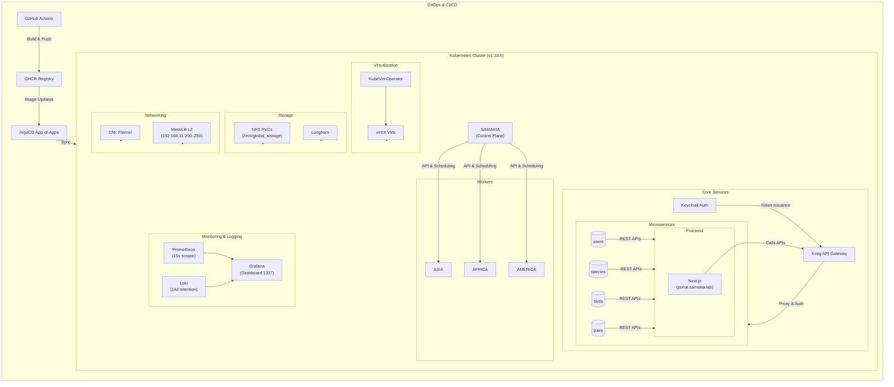

## Samakia Datacenter Architecture

```mermaid
flowchart LR
  subgraph GitOps & CI/CD
    A[GitHub Actions] -->|Build & Push| B[GHCR Registry]
    B -->|Image Updates| C[ArgoCD App-of-Apps]
    C -->|Sync| K8sCluster
  end


  subgraph K8sCluster["Kubernetes Cluster (v1.33.0)"]
    direction TB
    M["SAMAKIA\n(Control Plane)"]
    subgraph Workers
      W1[ASIA]
      W2[AFRICA]
      W3[AMERICA]
    end
    M -->|API & Scheduling| W1 & W2 & W3

    subgraph Networking
      Flannel[CNI: Flannel]
      MetalLB["MetalLB L2\n(192.168.11.200–250)"]
      Flannel --> K8sCluster
      MetalLB --> K8sCluster
    end

    subgraph Storage
      NFS["NFS PVCs\n(/mnt/global_storage)"]
      Longhorn[Longhorn]
      NFS & Longhorn --> K8sCluster
    end

    subgraph Virtualization
      KubeVirt[KubeVirt Operator]
      VM[virtctl VMs]
      KubeVirt --> VM
      VM --> K8sCluster
    end

    subgraph Core Services
      Kong[Kong API Gateway]
      Keycloak[Keycloak Auth]
      Kong -->|Proxy & Auth| Microservices
      Keycloak -->|Token Issuance| Kong
    end

    subgraph Microservices
      Users[(users)]
      Species[(species)]
      Birds[(birds)]
      Pairs[(pairs)]
      Users & Species & Birds & Pairs -->|REST APIs| Frontend
    end

    subgraph Frontend
      NextJS["Next.js\n(portal.samakia.lab)"]
      NextJS -->|Calls APIs| Kong
    end

    subgraph Monitoring & Logging
      Prom["Prometheus\n(15s scrape)"]
      Loki["Loki\n(14d retention)"]
      Grafana["Grafana\n(Dashboard 1337)"]
      Prom & Loki --> Grafana
    end
  end
```

